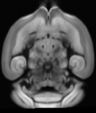
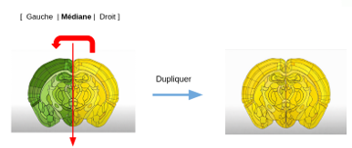
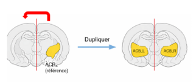
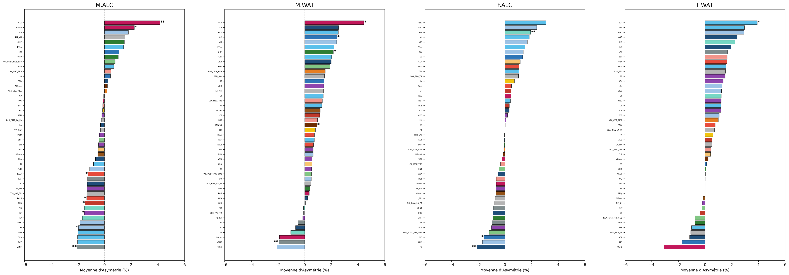
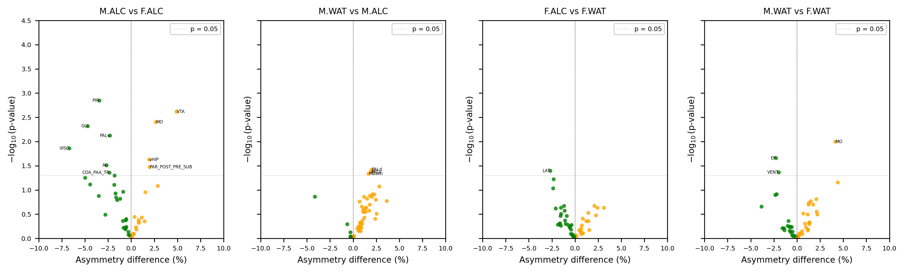
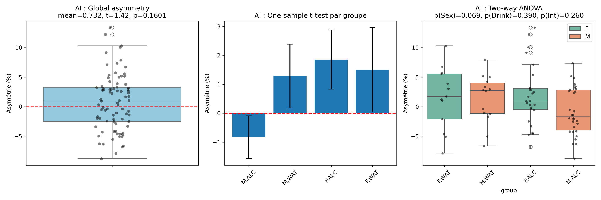

# Projet Asymétrie_Volumétrie

# 1. Analyse de l’asymétrie volumique cérébrale chez la souris

Ce projet vise à étudier l’asymétrie volumique de la région cérébrale ACB chez la souris, en fonction du sexe et de la consommation (alcool vs eau).  
Il combine des outils de traitement d’images, des calculs de volumes et des analyses statistiques pour comparer les hémisphères gauche et droit, et explorer l’impact des facteurs biologiques et environnementaux.

Les scripts permettent :
- de vérifier et corriger la symétrie des régions d’intérêt (ROIs),
- de calculer les volumes corrigés par le Jacobien,
- d’analyser statistiquement l’asymétrie entre groupes,
- de visualiser les résultats sous forme de graphiques.

Les données utilisées sont des fichiers CSV contenant les volumes mesurés et les métadonnées des sujets.

Il est basé sur [un article scientifique](https://www.sciencedirect.com/science/article/pii/S1053811925000175), visant à analyser l’asymétrie dans ACB selon des différents groupes.


## Données Utilisées :
Toutes les images jacobien et même les régions d'intérêt sont en format ``` .nii ``` 
##  symetry_atlas :



- Détecte l’axe L/R utilisant la fonction ```aff2axcodes``` de python

- Mesure l’asymétrie voxel par voxel :
    
    -> Compare chaque voxel 'L' vs son miroir 'R'.

    -> Compte combien de voxels sont différents (au‑delà d’une tolérance numérique tol = 10 e-6 ) , combien de nombre après la virgule.

    -> Calcule de voxels asymétriques :

```asym_vox_vox = 100 * (nbre de voxels différents / nbre total de voxels)```

- Reconstruit un atlas symétrique :

    -> Copiant la moitié droite et en la reflétant sur la gauche en fixant une coupe médiane "si la dimension de x est impaire", puis sauvegarde le nouveau Atlas Symétrique.

   
    


   
## symetry_Rois :

- Détecte l’axe L/R comme étape d'avant

- Comparaison entre deux ROIs (L/R):

Le ROI droit est retourné (flip) autour de l’axe L/R pour le mettre en correspondance avec le ROI gauche.( On peut alors comparer voxel par voxel.)

- Calcul du nombre de voxels actifs dans chaque ROI.

 == Le OR (|) marque les voxels en union

- Mesure de l’asymétrie par différence (XOR) entre ROI gauche et ROI droit retourné.

 == Le XOR (^) marque les voxels asymétriques

Le pourcentage d’asymétrie est calculé par :

```asym_percent = 100 * (nombre de voxels asymétriques / les voxels en union)```

#### --> FONCTION : make_rois_symmetric 
- Garder l’hémisphère droit comme référence.

- Générer un ROI gauche symétrique en retournant le ROI droit autour de l’axe L/R.

- Sauvegarder les deux ROIs corrigés séparés.



## 03_asy_many_roi.py :

#### --> FONCTION 1 : Calcul du volume physique des ROIs

```volume physique des ROIs = Nombre de voxels actifs * volume voxel```

== Conversion en mm³ et µm³.

#### --> FONCTION 2 : Calcul de la moyenne du Jacobien dans chaque ROI

- Sélection des voxels > 0 dans la ROI.

- Moyenne des valeurs Jacobien (ignore valeurs ≤ 0).

- Calcul des volumes corrigés par Jacobien

    ```vol_L = mean_L * volume physique ROI gauche```

    ```vol_R = mean_R * volume physique ROI droit```
#### --> Calcul de l’asymétrie

 ```Asymétrie = 100 * (R−L) / L```

#### --> Export des résultats

- Compilation des résultats pour tous les sujets.

- Sauvegarde dans un fichier ```res_asy_multiROI_2BC.csv``` avec des colonnes :

| Num_Mouse | ROI | R_vol_mm3 | L_vol_mm3 | mean_jac_L | mean_jac_R | asymmetry_% |
|-----------|-----|-----------|-----------|------------|------------|-------------|


## Les analyses statistiques :

Se trouve dans un dossier appelle ```stats``` dans le quel se trouve 3 scripts qui  réalisent une analyse statistique de l’asymétrie volumique de plusieurs régions chez la souris, en fonction du sexe et du drink (alcool vs eau). Il s’appuie sur les volumes calculés précédemment ```res_asy_multiROI.csv``` et les métadonnées des sujets ```ConnectDrink.csv```.

- ```res_asy_multiROI.csv``` est sous la forme suivante :

Num_Mouse |	ROI	R_vol_mm3 |  L_vol_mm3 | mean_jac_L |mean_jac_R | asymmetry_%
|-----------|-----|-----------|-----------|------------|------------|

- ```ConnectDrink.csv``` est sous la forme suivante :

Inclus	| Num_Mouse	| Sex |	Drink
|-------|-------|--------|-------|

## Objectif général des analyses statistiques

Les analyses statistiques visent à répondre à quatre questions principales :

**L’asymétrie moyenne d’un ROI est‑elle différente de zéro ?**

 → t‑test à un échantillon (global + par groupe)

**Les groupes expérimentaux diffèrent‑ils entre eux ?** 

→ t‑tests indépendants (pairwise)

**Quels sont les effets du Sexe, de la Boisson et de leur interaction ?**  

→ ANOVA Two‑Way (Sex × Drink)

**Quels ROIs montrent les asymétries les plus fortes ou les plus significatives ?** 

→ volcano plots + classements

Les analyses sont réalisées indépendamment pour chaque ROI.


## Analyses statistiques de l’asymétrie volumique

Cette section décrit les méthodes statistiques utilisées pour analyser l’asymétrie volumique des ROIs.
Toutes les analyses sont réalisées indépendamment pour chaque ROI à partir des valeurs d’asymétrie calculées précédemment.

---

## T-test global et par groupe (vs 0)

### Objectif

Tester si l’asymétrie moyenne est significativement différente de zéro, ce qui correspond à une absence de symétrie parfaite entre les hémisphères gauche et droit.

L’analyse est réalisée :

- globalement (toutes les souris confondues),
- séparément pour chaque groupe expérimental :
  - M.ALC
  - M.WAT
  - F.ALC
  - F.WAT

---

### Méthode – Test t à un échantillon

Le test t à un échantillon évalue si la moyenne d’un échantillon diffère d’une valeur de référence (ici 0) :

t = (x̄ − 0) / (s / √n)

où :

- x̄ = moyenne de l’asymétrie
- s = écart-type de l’asymétrie
- n = nombre de sujets

---

### Résultats et interprétation

Le test fournit :

- la statistique t,
- une p-value associée.

- p < 0.05 : l’asymétrie moyenne est significativement différente de 0  
- p ≥ 0.05 : aucune asymétrie significative détectée  

Le signe de la moyenne permet d’interpréter la direction de l’asymétrie :
- valeur positive → volume droit > volume gauche (R > L)
- valeur négative → volume gauche > volume droit (L > R)

---

## T-tests entre deux groupes (pairwise)

### Objectif

Comparer deux groupes indépendants afin de déterminer si leur asymétrie volumique diffère significativement.
Les comparaisons suivantes sont réalisées pour chaque ROI :

- M.ALC vs F.ALC
- M.WAT vs M.ALC
- F.ALC vs F.WAT
- M.WAT vs F.WAT



---

### Méthode – Test t indépendant (Welch)

Un test t indépendant de Welch est utilisé afin de ne pas supposer l’égalité des variances entre les groupes :

t = (x̄₁ − x̄₂) / √(s₁² / n₁ + s₂² / n₂)

où :

- x̄₁, x̄₂ = moyennes des deux groupes
- s₁, s₂ = écarts-types
- n₁, n₂ = tailles des groupes

---

### Résultats et interprétation

Pour chaque ROI, le test retourne :

- diff : différence de moyennes (groupe 1 − groupe 2),
- p_value : p-value du test,
- logp : −log10(p_value),
- direction de l’effet :
  - Right si diff > 0
  - Left si diff < 0

Une p-value inférieure à 0.05 indique une différence significative entre les deux groupes.

Les résultats sont visualisés sous forme de volcano plots.


---

## ANOVA Two-Way (Sex × Drink)

### Objectif

Évaluer l’effet de deux facteurs expérimentaux sur l’asymétrie volumique :

- Sexe (M vs F),
- Boisson (ALC vs WAT),
- Interaction Sexe × Boisson.

Cette analyse permet de déterminer si l’effet de la boisson dépend du sexe.

---

### Méthode

Un modèle linéaire à deux facteurs est utilisé :

asymmetry ~ Sex + Drink + Sex:Drink

Une ANOVA à deux facteurs (Type II) est appliquée afin de tester :

- l’effet principal du sexe,
- l’effet principal de la boisson,
- leur interaction.

---

### Résultats et interprétation

Pour chaque ROI, l’ANOVA fournit :

- une p-value pour l’effet du sexe,
- une p-value pour l’effet de la boisson,
- une p-value pour l’interaction Sexe × Boisson.

- Un effet principal significatif indique que le facteur influence l’asymétrie.
- Une interaction significative indique que l’effet de la boisson diffère selon le sexe.

Les effets sont visualisés à l’aide de volcano plots séparés pour chaque facteur.


